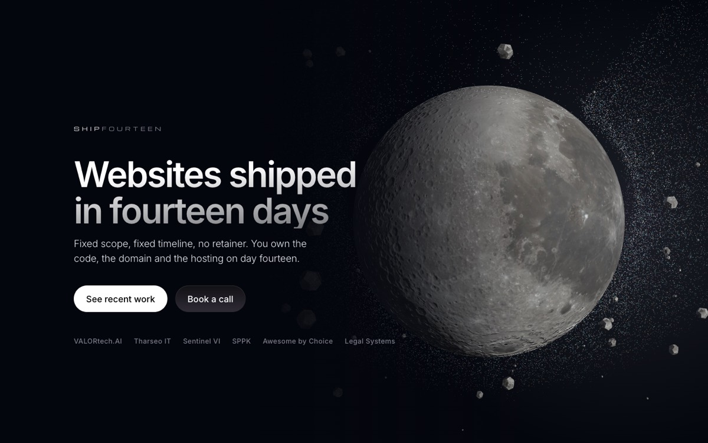

# shipfourteen.com

Static site. One `index.html`, no build step, no framework.



Live at **https://shipfourteen.com**.

## Deploy

```bash
npx vercel deploy --prod --yes
```

Vercel project: `shipfourteen-web` (team `m3kalis-3804's projects`).
Serves `shipfourteen.com`; `www` 308-redirects to the apex.

## Local

```bash
python3 -m http.server 4317
```

`file://` will not work — the ES module import map needs a real origin.

## Layout

```
index.html              everything: markup, CSS, the three.js scene
vendor/three.module.js  pinned to r169
fonts/                  Inter (variable, subset) + Michroma (wordmark only)
assets/moon-*.webp      NASA colour + elevation maps, see assets/CREDITS.md
assets/work-*.webp      build log screenshots, 1280x800
assets/og.jpg           social card, regenerate after any hero change
```

## The rules this page is built on

- **Every portfolio claim must be checkable.** One entry is a client launch;
  the rest are labelled as redesigns, concepts or personal work, and each
  redesign links the incumbent site it would replace. Do not soften these
  labels. The incumbent is one click away and being caught is fatal.
- **Michroma is for the wordmark only.** It has leaked into section numbering
  before and was reverted. Everything else is Inter.
- **Two visual weights for status**, filled and hollow. A third grade makes
  four of six entries read as rejects.
- **Cards are for the build log only.** Everything else is hairline rows. The
  page had twenty identical boxes once; it is not going back.

## Things that will bite you

- **The fonts are subsets.** `inter-latin.woff2` covers ASCII, Latin-1 and some
  punctuation; `inter-latin-ext.woff2` covers the Slovak set only
  (`U+010C-010F, U+0139-013A, U+013D-013E, U+0147-0148, U+0154-0155,
  U+0160-0161, U+0164-0165, U+017D-017E`). Copy with a character outside those
  silently falls back to the system font. Re-subset with `pyftsubset` and widen
  the `unicode-range` together — widening only one of them does nothing.
- **Arrow glyphs must be inline SVG.** Google's Inter latin subset has `U+2191`
  and `U+2193` but no `U+2197`, so a `↗` character can never resolve. The link
  arrow is drawn, not typed.
- **The hero orbit is two SVGs around a transparent canvas.** `.orbit-back`
  holds the far arc, `.orbit-front` the near one; the moon occludes the first
  and is crossed by the second. Both share `viewBox="0 0 1000 1000"` and
  `preserveAspectRatio="xMidYMid meet"`, which is what keeps them aligned with
  zero JS. Change one viewBox and you must change both.
- **The camera distance is derived, not fixed.** `resize()` solves for
  `TARGET = 0.30`, the moon's radius as a fraction of `min(w, h)`, so the
  sphere and the SVG ellipse scale together. Hard-coding `camera.position`
  again will break the alignment at some viewport.
- **The schedule draw-on uses `clip-path`, not `stroke-dasharray`.** With
  `vector-effect: non-scaling-stroke` the dash unit is screen pixels, not
  viewBox units, so any fixed dasharray truncates the curve at wide viewports.
- **`.hero-stage` needs `width: 100%` on stacked layouts.** All of its children
  are absolutely positioned, so with `margin-inline: auto` and a `max-width`
  alone it shrinks to zero width and `aspect-ratio` then gives it zero height.
- **Reduced motion is a global `animation: none !important`.** Any reveal whose
  *base* state is hidden will stay hidden forever. Base states must be visible;
  only put the hidden state inside `@media (prefers-reduced-motion: no-preference)`.
- **The sticky bar keys off `boundingClientRect.top < 0`,** not merely
  `!isIntersecting`, which is also true before you have reached the sentinel.
- **three.js loads in `requestIdleCallback`,** so the planet appears after the
  text. That is deliberate: it keeps ~263 KB gzipped out of the first paint.

## Open follow-ups

- The booking CTA still points at `cal.com/matuskalis/scoping-call`, whose event
  is titled *AI Feature Sprint — Scoping Call*. Swap the slug once a
  website-sprint event exists.
- `assets/matus.webp` does not exist yet; the founder section renders an empty
  photo slot until it does.
- The scene is now a single lit sphere paying ~263 KB gzipped of three.js. A
  hand-rolled sphere shader (~4 KB) would remove the largest asset on the site.

## Regenerating the social card

```bash
python3 -m http.server 4317
# screenshot the hero at 1200x630, then:
sips -s format jpeg -s formatOptions 82 og-raw.png --out assets/og.jpg
```

## Previous site

The AI Feature Sprint site is still deployed at `shipfourteen-site.vercel.app`
(project `shipfourteen-site`). It no longer holds the apex domain.

## Licence

The code in this repository is MIT (see `LICENSE`). That does not extend to
the ShipFourteen wordmark, the copy, the client screenshots in `assets/work-*`
or the photograph in `assets/matus.webp`. The moon maps are NASA source under
the terms recorded in `assets/CREDITS.md`.
